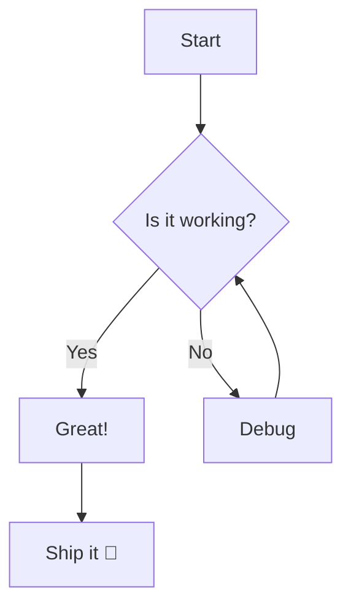
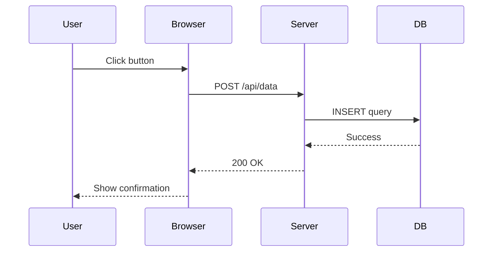
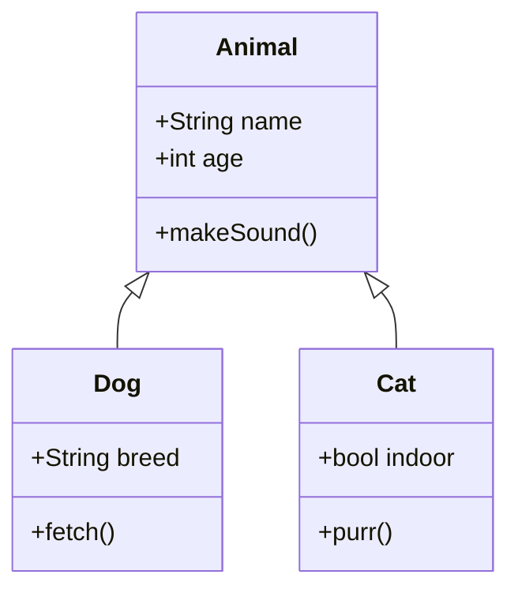
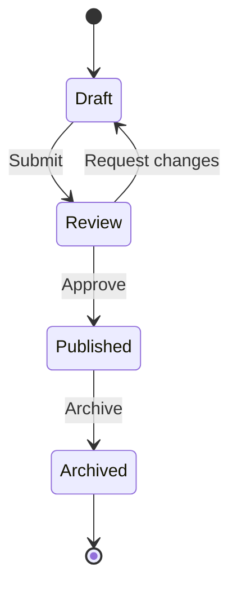
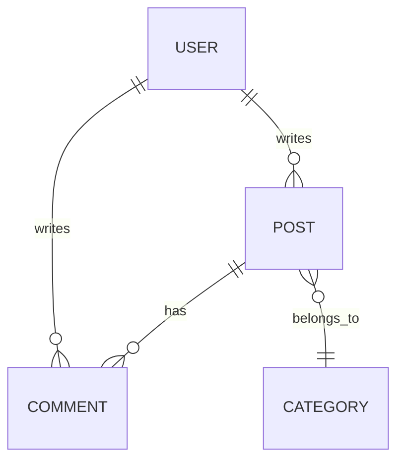
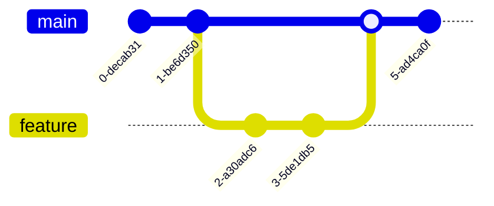
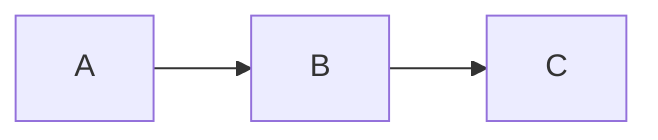

Mermaid diagrams render automatically from fenced code blocks with the `mermaid` language tag.

## Flowchart



## Sequence Diagram



## Class Diagram



## State Diagram



## Entity Relationship Diagram



## Git Graph



## Usage

Write a fenced code block with the `mermaid` language identifier:

````mdx

````

See the [Mermaid documentation](https://mermaid.js.org/intro/) for all supported diagram types and syntax.
